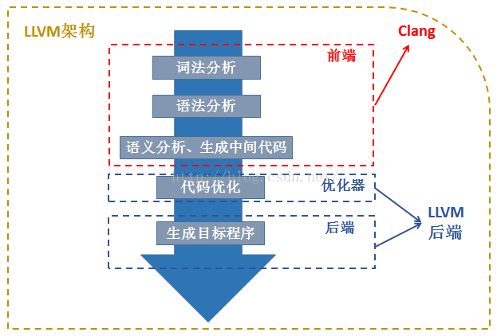

# LLVM要点笔记

## Project过程中的一些实际问题

### LLVM Installment
参考：[官方安装方式](http://clang.llvm.org/get_started.html)

命令:
```bash
cmake -DLLVM_ENABLE_PROJECTS=clang -G "Unix Makefiles" ../llvm 
```
安装后为debug版本，有20个G，可以通过以下命令安装release版本：
```bash
cmake -G "Unix Makefiles" \
>   -DCMAKE_BUILD_TYPE=Release \
>   -DCMAKE_EXPORT_COMPILE_COMMANDS=ON \
>   -DLLVM_BUILD_LLVM_DYLIB=ON \
>   --enable-optimized \
>   --enable-targets=host-only \
>   ../llvm
```
### 安装之后要将/build/bin加入path
根据官网安装之后，注意要add llvm to your path，否则会报错llvm-config not found
我的方法是vim /etc/paths，加入/llvm/build/bin的**绝对**路径。

[Ubuntu下安装以及链接方法可参考](https://www.isi.edu/~pedro/Teaching/CSCI565-Fall16/Projects/LLVM-Installation/LLVMInstructions-Ubuntu.pdf)

### 没有"llvm/ADT/STLExtras.h"头文件

```bash
clang++ -g -O3 toy.cpp `llvm-config --cxxflags --ldflags --system-libs --libs core` -o toy
```

### 编译过程和各个文件的作用？

LLVM将代码翻译成x86平台，有以下几步：

1. 将源代码翻译成bitcode
2. 选择性的优化bitcode
3. 将bitcode转换装配到目标平台

编译过程产生的一些文件后缀名解释：

- .bc文件是未被优化的clang输出的LLVM bytecode
- .ll是接装配的LLVM bytecode，通过llvm从.bc中生成(human-readable)
- .s是针对平台的汇编装配文件，通过llc从.bc生成
- 可执行文件通过汇编程序like gcc从.s生成

上述LLVM命令 (clang, llc, llvm-dis)都能从 /unsup文件中获取

## LLVM架构问题

### LLVM与Clang的关系？



